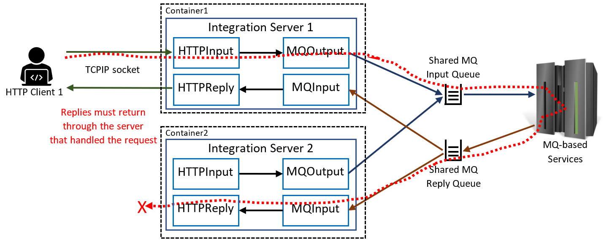

# ace-http-mq-request-reply
Examples of App Connect Enterprise request/reply correlation with HTTP and MQ

This repo is intended to be used in conjunction with the blog post at 
https://community.ibm.com/community/user/integration/blogs/trevor-dolby/2022/11/15/scaling-ace-integrations-that-use-mq-requestreply, 
providing examples that can be used to explore how to solve issues around HTTP-toMQ flows 
that have more than one replica.

Without the right design, scaling servers up can lead to issues with replies being received by
the wrong server:

Using the MQBackend application as the common MQ service, the other applications in this repo
show various mechanisms that allow replies to be routed correctly (with the exception of the 
NoCorrelationClient, which exists to show the failure).
